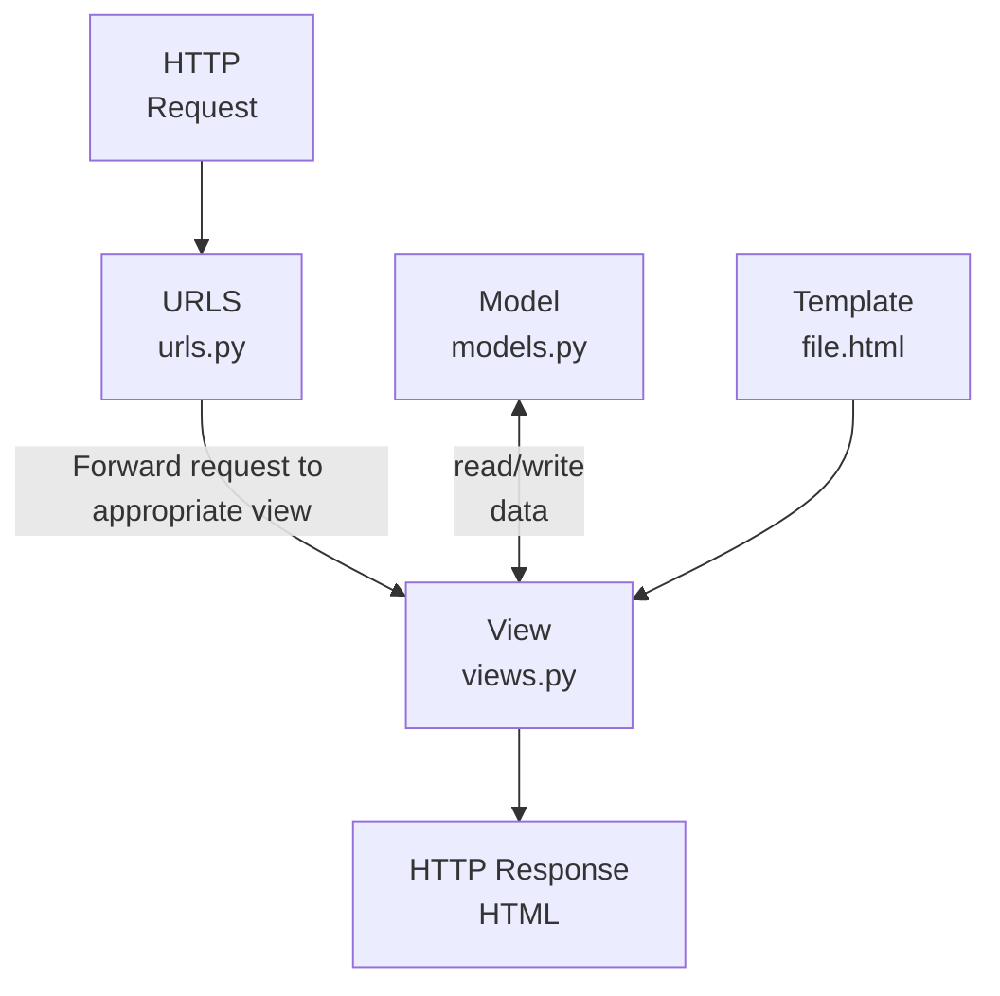

# locallibrary
Django tutorial

https://developer.mozilla.org/ja/docs/Learn/Server-side/Django/skeleton_website

## Source code
[mdn/django-locallibrary-tutorial](https://github.com/mdn/django-locallibrary-tutorial)

## [Testing](Testing.md)
